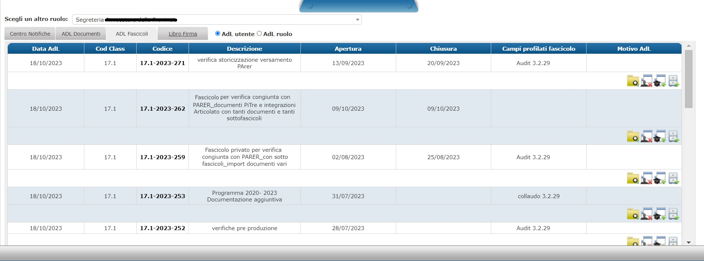
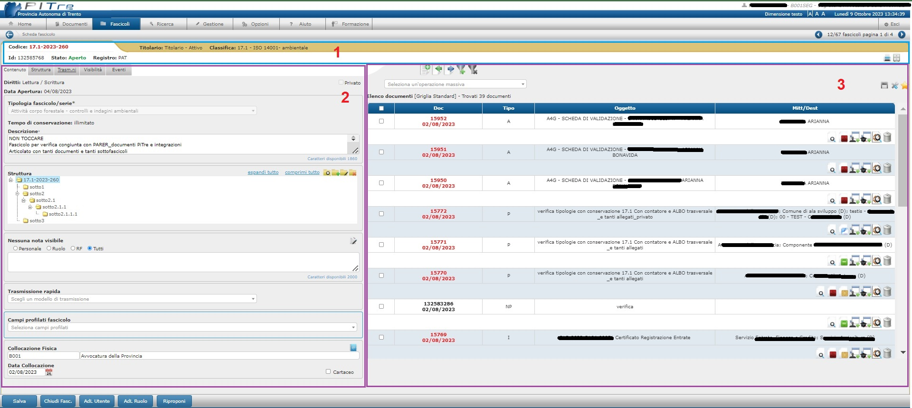
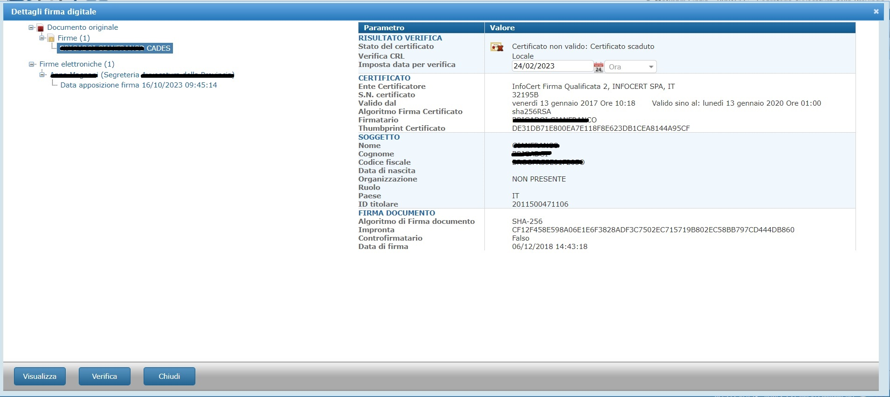
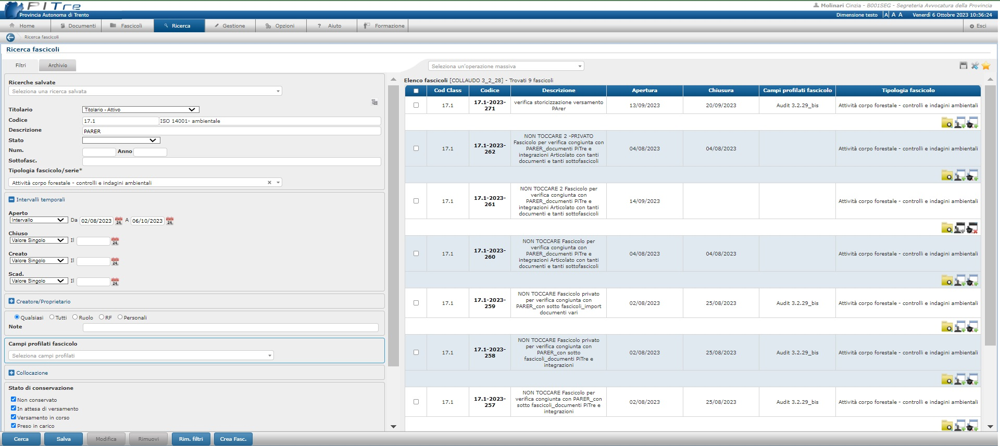
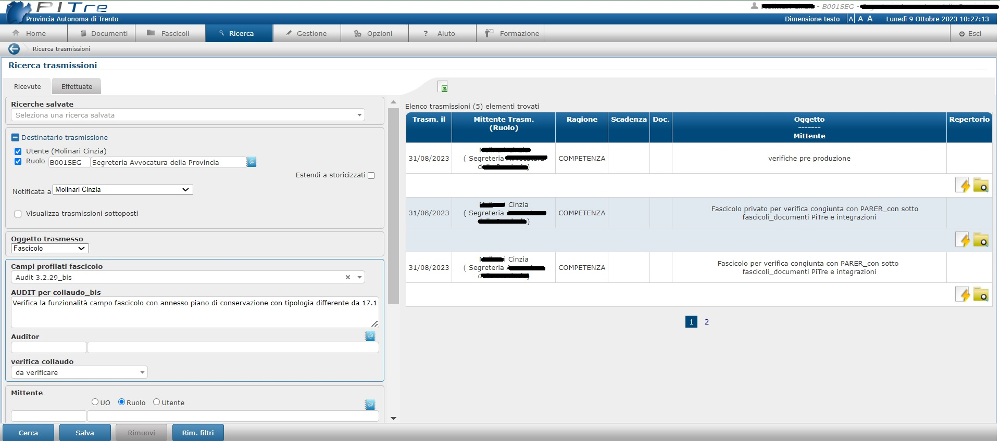
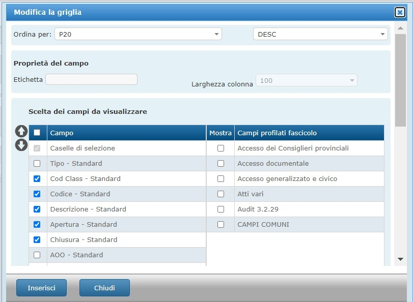
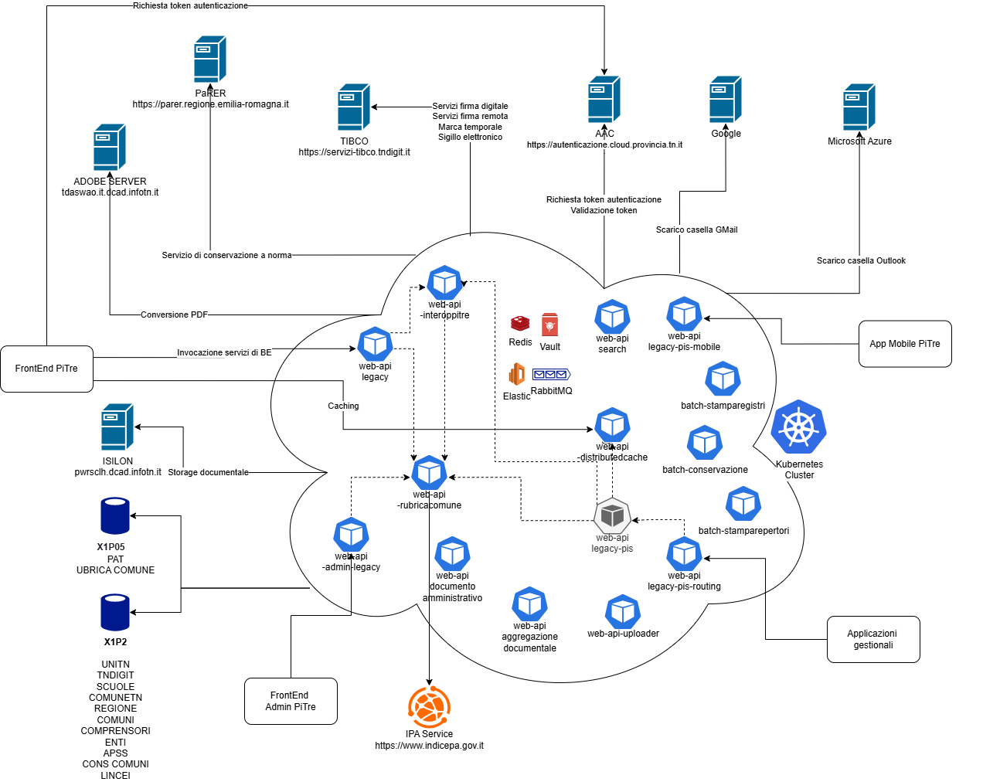

# *PiTre – cloud transformation*

## *Una piattaforma documentale cloud-native per la gestione digitale e sicura dei documenti nella pubblica amministrazione trentina*

### Descrizione estesa del repository 

#### Contesto di utilizzo
Il progetto PiTre (Protocollo Informatico Trentino) è una piattaforma documentale utilizzata quotidianamente da centinaia di enti pubblici del territorio trentino per la gestione dei documenti amministrativi, dei fascicoli e delle comunicazioni ufficiali.
Levoluzione architetturale descritta in questo repository si inserisce nel percorso di transizione digitale promosso dalla Provincia Autonoma di Trento, con il supporto dei fondi europei FESR 2021–2027, e ha come obiettivo la modernizzazione della componente Back-End del sistema, rendendola scalabile, sicura e pronta per il cloud.

#### Casi d'uso
Il sistema è progettato per supportare diversi attori e scenari operativi all'interno della Pubblica Amministrazione. Di seguito alcuni esempi rappresentativi:
- **Addetto alla protocollazione**: crea un nuovo documento, lo protocolla in arrivo, partenza o interno, lo classifica e lo fascicola secondo il titolario vigente. Può inoltre allegare file, gestire versioni e inviare il documento tramite trasmissione interna o interoperabilità.
- **Utente avanzato**: utilizza funzionalità come l’Area di Lavoro (AdL), la gestione delle note, le parole chiave, le catene documentali e la creazione di documenti in risposta, per una gestione efficiente e personalizzata dei flussi documentali.
- **Dirigente o funzionario**: accede al sistema per firmare digitalmente o elettronicamente documenti tramite il Libro Firma, anche in modalità PADES, CADES o HSM, seguendo un processo approvativo definito.
- **Cittadino**: riceve una notifica via email relativa a un documento trasmesso da un ente (es. ricevuta di protocollazione, comunicazione ufficiale, avviso).
- **Sistema gestionale esterno**: interagisce con il sistema tramite API per inviare o ricevere documenti in modalità interoperabile.
- **Amministratore**: configura gli aspetti di PiTre (es. organigramma, titolario, profili documentali, ecc.).
- **Responsabile della conservazione**: verifica la corretta trasmissione dei documenti al sistema di conservazione digitale a norma.

#### Finalità del software
Il software ha l’obiettivo di:

- Digitalizzare e semplificare la gestione documentale nella pubblica amministrazione.
- Garantire la sicurezza e la tracciabilità dei documenti e delle operazioni.
- Supportare l’interoperabilità con altri sistemi pubblici (es. SPID, CIE, ParER, PEC, IPA).
- Abilitare l’evoluzione tecnologica grazie a un’architettura a microservizi, scalabile e cloud-native.
- Favorire il riuso da parte di altre amministrazioni, nel rispetto delle linee guida AGID.

#### Screenshot
  

  

  

  

  

  

#### Pagine istituzionali
- Portale ufficiale PiTre
- Trentino Digitale – Progetto PiTre
- GitHub Provincia Autonoma di Trento – Repository pubblico

#### Stato del progetto
- Stato: Stabile
- Limitazioni: Nessuna

### Struttura del repository di frontend
Il repository contiene il codice della soluzione di FrontEnd di PiTre.

Il Frontend è una applicazione Microsoft .net Web application sviluppata in tecnologia ASP.NET con framework 4.0 che utilizza per il code Behind C# come linguaggio.
Le pagine sono scritte in HTML5 e contengono costrutti Javascript e Ajax.
Il Front End, applicazione server side, è deployato su una Farm dedicata e per ogni istanza viene installata una specifica applicazione.  Colloquia con il nuovo BackEnd, installato su cluster Kubernetes, mediante un bilanciatore intranet.

### Struttura del repository di backend
Il repository è organizzato secondo i principi della Clean Architecture e del Domain-Driven Design (DDD), con una chiara separazione tra logica di dominio, infrastruttura tecnologica e applicazioni. Questa struttura consente una maggiore manutenibilità, scalabilità e riusabilità del codice.

####  Organizzazione generale
Il codice è suddiviso in tre macro-livelli:

- Core: contiene il modello di dominio, ovvero le regole di business, gli oggetti principali (documenti, fascicoli, trasmissioni, ecc.) e le interfacce dei servizi.
- Infrastructure: contiene le implementazioni concrete delle interfacce definite nel Core, come l’accesso al database, l’integrazione con servizi esterni (es. firma digitale, conservazione, PEC).
- Application: contiene i microservizi veri e propri (Web API e batch), che orchestrano le operazioni e espongono le funzionalità tramite API RESTful.

#### Esempio di struttura di un microservizio
Ogni microservizio segue una struttura coerente. Ad esempio, il progetto Pi3.App.DocumentoAmministrativo.WebApi è organizzato come segue:

| Cartella / File         | Descrizione                                                                 |
|-------------------------|------------------------------------------------------------------------------|
| `Controllers/`          | Espone le API REST per la gestione del documento amministrativo             |
| `Commands/`             | Contiene i comandi CQRS per le operazioni di scrittura                      |
| `Queries/`              | Contiene le query CQRS per le operazioni di lettura                         |
| `Models/`               | Definisce i DTO e gli oggetti di scambio tra API e dominio                  |
| `Middleware/`           | Middleware per logging, gestione errori e autenticazione                    |
| `Resources/`            | File `.resx` per la localizzazione e i messaggi multilingua                 |
| `Program.cs`            | Punto di ingresso dell'applicazione e configurazione dei servizi            |
| `appsettings.*.json`    | File di configurazione per ambienti (Development, Test, Production, ecc.)   |

#### Test e qualità del codice
La qualità del codice è monitorata tramite SonarQube, con regole di sicurezza e qualità automatizzate (es. OWASP Top 10, bugs, vulnerabilities, code smells).

#### Prerequisiti e dipendenze

**ATTENZIONE: QUESTA SOLUZIONE PREVEDE L'USO DI UNA LICENZA COMMERCIALE PER LE LIBRERIE CHILKAT oppure L'IMPLEMENTAZIONE AUTONOMA DELLE FUNZIONALITA' FORNITE DALLE STESSE**

Per utilizzare e compilare il software, sono richiesti i seguenti prerequisiti:

- **Sistemi operativi supportati**:  
  - Windows 10/11  
  - Linux (Ubuntu 20.04+)

- **Framework .NET**:  
  - .NET 6.0  
  - .NET 8.0 (per alcune componenti)  
  - .NET 8.0-windows (per eventuali estensioni desktop)

- **Librerie principali**:
  - **Autenticazione e sicurezza**: `Microsoft.AspNetCore.Authentication.JwtBearer`, `OAuth2`, `AAC`, `Serilog`
  - **API REST e versioning**: `Swashbuckle.AspNetCore`, `Asp.Versioning.Mvc`
  - **Integrazione e interoperabilità**: `RabbitMQ.Client`, `Redis`, `Oracle.ManagedDataAccess.Core`, `Refit`
  - **Gestione documentale**: `iText7`, `DocumentFormat.OpenXml`, `BouncyCastle`, `Chilkat`
  - **Monitoraggio e logging**: `Elastic.Apm`, `Serilog`
  - **Testing**: `NUnit`, `Microsoft.AspNetCore.Mvc.Testing`, `coverlet.collector`

- **Dipendenze esterne e commerciali**:
	- `Chilkat`: librerie commerciali già licenziate per PAT ma che richiedono una nuova licenza se il software viene preso in riuso;
  		Le funzionalità di chilkat utilizzate sono contentute nel progetto “Pi3.Infrastructure.Chilkat”:
		- invio email PEC / PEO
		- scansione casella di posta PEC / PEO
		- verifica se un file pdf è firmato digitalmente pades	
	
		Se un utilizzatore dovesse trovare librerie alternative valide che facciano questi servizi, potrebbe tranquillamente integrarle nel sistema senza alcuna modifica per le restanti parti.

	- `AutoMapper`e `MediatR`: diventate licenza commerciali dal 2 luglio 2025, rimane gratutita fino alle versioni **AutoMapper 14.x** e **MediatR 12.x**.
	Attenzione nell'aggiornamento versione. Vale lo stesso discorso fatto sopra per Chilkat, in caso di vulnerabilità sui vecchi pacchetti si dovrà pagare una licenza o implementare in maniera 		alternativa le funzionalità esistenti.

> L’elenco completo delle dipendenze è disponibile nei file `.csproj` e `packages.config` dei singoli progetti.

#### Architettura a microservizi
L'architettura di BackEnd è suddivisa in microservizi, ognuno dei quali si occupa di un ambito applicativo dedicato ed è istanziato all’interno di un POD. Ogni micro servizio espone le proprie funzionalità tramite API RESTful e utilizza le funzionalità core del BackEnd messe a fattor comune in package NuGet.

I microservizi con la dicitura “legacy” sono stati realizzati unicamente per esporre le funzionalità alle applicazioni client attualmente in esercizio, stando ad indicare che l’ambito è circoscritto ad un client già esistente e con il quale è necessario mantenere la compatibilità lasciando invariate le interfacce: FrontEnd di PiTre, AdminTool, App Mobile, Pis interoperabilità.

Di seguito, sono descritti gli aspetti principali dei servizi classificati come legacy:
- web-api-legacy-*: 
	- Espone le API rivolte esclusivamente all’attuale FrontEnd di PiTre. Sono state riscritte con la nuova infrastruttura e, per mantenere la compatibilità, sono esposti servizi con le stesse denominazioni utilizzate attualmente dal FrontEnd. 
	- I servizi esposti da web-api-legacy, in base alla denominazione, possono essere ulteriormente classificati e tramite una configurazione che avviene su traefic, ingress del cluster, dirottati su specifici POD, permettendo di isolare le chiamate più critiche senza modificare il codice dell’applicazione. 

- web-api-legacy-admin:
	- Espone i servizi rivolti esclusivamente all’attuale AdminTool di PiTre. Per mantenere la compatibilità, sono stati esposti servizi con le stesse denominazioni e stessa tecnologia utilizzate attualmente dal FrontEnd dell'Admin Tool. Questa componente include alcuni package nuovi, ma non segue i paradigmi Domain-Driven Design (DDD).

- web-api-legacy-mobile:
	- Espone i servizi rivolti esclusivamente all’attuale app mobile di PiTre. Per mantenere la compatibilità, sono stati esposti servizi con le stesse denominazioni utilizzate attualmente dall'app mobile.

- web-api-legacy-pis: 
	- È la versione cloud delle API PIS, rivolta esclusivamente alle applicazioni gestionali che già utilizzavano i servizi PIS sull’infrastruttura IIS. Sono stati riscritti con la nuova infrastruttura e, per mantenere la compatibilità, sono esposti servizi con le stesse denominazioni utilizzate dalle applicazioni.

Altri microservizi sono stati progettati per avere un ambito più ampio e possono essere utilizzati da diversi client. Questi servizi implementano il versioning delle API per garantire la compatibilità e facilitare l'evoluzione delle funzionalità nel tempo. I microservizi classificati in tale ambito sono:
- web-api-documentoamministrativo: 
	- Gestione del documento amministrativo secondo lo schema definito da AgID all.5.

- web-api-aggregazionedocumentale: 
	- Gestione dell’aggregazione documentale secondo lo schema definito da AgID all.5.

- web-api-uploader: 
	- Gestione dell’upload di file nel repository documentale. L’invio viene effettuato in chunk, pertanto possono essere gestiti anche file di grandi dimensioni.

- web-api-distributedcache: 
	- Gestione delle informazioni mantenute nella cache distribuita su Redis.

- web-api-rubricacomune: 
	- Gestione della rubrica comune.

- web-api-interoppitre: 
	- Gestione dell’interoperabilità applicativa tra le istanze PiTre.

I microservizi introdotti utilizzano logica applicativa in comune implementata in librerie distribuite mediante package NuGet (Pi3 packages). Le librerie sono state implementate seguendo i paradigmi Domain-Driven Design (DDD), che enfatizza la modellazione del dominio del problema attraverso entità e aggregati, e Clean Architecture, che promuove la separazione delle responsabilità e l'indipendenza dai dettagli di implementazione.

La distribuzione delle librerie in package NuGet ha i seguenti vantaggi:
-	Riutilizzo del codice: Consente di evitare la duplicazione del codice, migliorando la manutenibilità e riducendo il rischio di errori.
-	Consistenza: Garantisce che tutti i microservizi utilizzino la stessa logica applicativa, mantenendo la coerenza nel comportamento del sistema.
-	Aggiornamenti centralizzati: Permette di aggiornare la logica comune in un unico punto, propagando le modifiche a tutti i microservizi che utilizzano il package.
-	Sviluppo accelerato: Riduce il tempo necessario per sviluppare nuovi microservizi, poiché possono utilizzare le librerie esistenti.

L'indipendenza dai dettagli di implementazione garantisce che gli aspetti relativi all'utilizzo di specifiche piattaforme tecnologiche (es. database Oracle per la persistenza, infrastruttura per l’uso di servizi di firma digitale, caching con Redis, accodamento con RabbitMQ, Elastic per la ricerca fulltext, ecc.) siano disaccoppiati dalla logica di business.
L'architettura così costruita è predisposta per sostituire le tecnologie sottostanti senza impatti sulla logica di business, facilitando l'adozione di nuove soluzioni tecnologiche. Ad esempio, è possibile implementare nuove librerie che implementano la persistenza degli aggregati DDD in altri motori di database relazionali oppure NoSql, oppure implementare nuovi motori di caching o accodamento, oppure includere un nuovo motore di conversione PDF, e sostituire tutti questi aspetti infrastrutturali nell’applicazione senza alcun impatto sulla logica esistente.

La figura sottostante rappresenta la configurazione di deployment dell'architettura backend del sistema PiTre, strutturata in microservizi per garantire modularità e scalabilità.

#### Istruzioni per l'installazione in dev e prod
1. Procedura di installazione di requisiti e dipendenze:
   - 1. Clona il repository
2. Apri la soluzione con Visual Studio 2022+
3. Ripristina i pacchetti NuGet
4. Compila la soluzione
   
2. Build system:
   - MSBuild o Visual Studio

3. Comandi per la compilazione o il deployment:
   - `dotnet build`, `dotnet publish`    

#### Continuous Integration e metriche

Il progetto utilizza un sistema di **Continuous Integration (CI)** e **Continuous Delivery (CD)** basato su **GitLab CI/CD**, con pipeline automatizzate per la build, il test e il rilascio dei microservizi.

- Le pipeline sono definite nel progetto `template-ci` e condivise tra tutti i microservizi.
- Il rilascio in ambiente Kubernetes è gestito tramite **ArgoCD**, con descrittori Helm versionati nel repository `pitre-env`.

#### Metriche e qualità del codice

- La **copertura del codice** e la **qualità statica** sono monitorate tramite **SonarQube**.
- Le metriche di performance e disponibilità sono raccolte tramite **Elastic APM** e visualizzate su **Grafana**.

#### Documentazione per il deployment

Il progetto utilizza un'infrastruttura moderna per semplificare e automatizzare il processo di deployment in tutti gli ambienti (sviluppo, test, quality, produzione).

#### Strumenti utilizzati

- **GitLab CI/CD**: per la gestione delle pipeline di build, test e promozione tra ambienti.
- **ArgoCD**: per il deployment automatico su cluster Kubernetes, secondo il paradigma GitOps.
- **Helm**: per la gestione dei template di configurazione e dei rilasci.
- **Docker**: ogni microservizio è containerizzato e pubblicato su un registry privato (Harbor).
- **Vault**: per la gestione sicura dei segreti e delle credenziali nei file di configurazione.

#### Ambienti supportati

- **Test**: ambiente di verifica tecnica
- **Quality**: ambiente di pre-produzione
- **Formazione**: ambiente per la formazione degli utenti
- **Produzione**: ambiente operativo

####  Note
- Il deployment è completamente automatizzato e tracciato.
- Non sono attualmente previste immagini Docker pubbliche, ma è possibile generarle localmente tramite le pipeline GitLab.

### Detentori di copyright
Questo progetto è di proprietà della Provincia Autonoma di Trento.

### Mantenimento del progetto
Il progetto è mantenuto da Trentino Digitale Spa.

Responsabile Divisione Servizi Piattaforme: Alessandro Celli - <alessandro.celli@tndigit.it>	

### Segnalazioni di sicurezza
Per segnalazioni di sicurezza, ti preghiamo di contattare sicurezza@tndigit.it. Si prega di non inviare segnalazioni di sicurezza attraverso l'issue tracker pubblico, ma di inviarle confidenzialmente a questo indirizzo e-mail.
