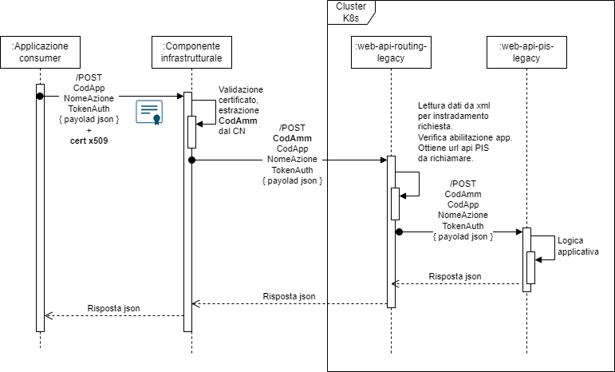

# Pi3.App.Legacy.PIS.WebApi

## Introduzione
Nell'ambito della nuova architettura del PiTre in cloud, **Pi3.App.Legacy.PIS.WebApi** è il microservizio dell'area Legacy che espone le funzionalità dei PIS (Product Integration Services) ad applicazioni o prodotti di terze parti affinché possano integrarsi col protocollo federato.

Il servizio è stato reingegnerizzato e portato sulla nuova piattaforma mantenendo invariati gli schemi di comunicazione e le modalità di accesso ed utilizzo per non causare disservizi alle applicazioni. Per ulteriori informazioni, consultare la documentazione [qui](/Docs/WebServicesPIS_A-PI3-PIS_01_15_dicembre_2017.pdf).

All'interno del cluster Kubernetes, l'api è distribuita in due POD:
- **web-api-routing-legacy**, esposto in https alle applicazioni secondo le attuali modalità
- **web-api-pis-legacy**, non esposto in https, utilizzato solo da web-api-routing-legacy per indirizzare internamente le richieste

## Url Swagger

| Ambiente | Url Swagger |
| ---------| ------------|
| TEST | https://pitre-test.cloud-test-intra.tndigit.it/LegacyPisRouting/swagger/index.html |
| QUALITY | https://pitre-qual.cloud-qual-intra.tndigit.it/LegacyPisRouting/swagger/index.html |
| COLLAUDO | https://pitre-coll.cloud-qual-intra.tndigit.it/LegacyPisRouting/swagger/index.html |
| FORMAZIONE | https://pitre-formazione.cloud-intra.tn.it/LegacyPisRouting/swagger/index.html |
| PRODUZIONE | https://pitre.cloud-intra.tn.it/LegacyPisRouting/swagger/index.html |

## Linguaggio, piattaforma e tool di sviluppo
C# 10, .NET 6, Visual Studio 2022.

## Struttura interna dell'applicazione

L'applicazione è suddivisa nei seguenti progetti:

| Nome progetto  | Descrizione |
| ------------- | ------------- |
| Pi3.App.Legacy.Pis.WebApi | Progetto che implementa l'applicazione Web con gli Api controller, i middleware, gli action filters, gli aspetti di registrazione delle librerie e dei package utilizzati. |
| Pi3.App.Legacy.Pis.WebApi.Tests | Progetto che implementa i test unitari. |
| Pi3.App.Legacy.Pis.WebApi.sln | File di solution. |

## Autenticazione e flusso di elaborazione delle richieste
Le modalità di autenticazione e il flusso di elaborazione delle richieste restano invariate rispetto agli attuali servizi PIS REST:
1) L'applicazione effettua la chiamata verso la componente infrastrutturale inviando nella richiesta un certificato x509, il codice applicazione chiamante, il nome dell'azione da richiamare, il token di autenticazione e il payload json della richiesta.
2) La componente infrastrutturale riceve la richiesta, valida il certificato ed estrae il CN (Common Name) contenente il codice dell'applicazione chiamante.
3) La componente infrastrutturale inoltra la chiamata http al servizio PIS **web-api-routing-legacy** fornendo nell'header tutte le informazioni ricevute dall'applicazione client ed il del codice amministrazione (estratto dal CN del certificato).
4) Il servizio PIS **web-api-routing-legacy** riceve le richieste validando le informazioni ricevute in input. Mediante le informazioni presenti in un file .xml, effettua l'instradamento delle richieste, tramite http, all'api **web-api-pis-legacy** (non esposta esternamente al cluster).
5) L'api **web-api-pis-legacy** applica la logica applicativa e genera la risposta json che viene restituita all'applicazione chiamante.

## Progetto Pi3.App.Legacy.Pis.WebApi
Nel progetto sono implementate le Api controller, i middleware, gli action filters e gli aspetti di registrazione delle librerie e dei package utilizzati dall'applicazione.

### Api controller
L'applicazione espone alle applicazioni consumer il seguente Api controller:
- RESTRouterController

#### RestRouterController
Espone 3 endpoint che accettano genericamente le richieste dalle applicazioni. Internamente, mediante le informazioni presenti in un file .xml, effettuano il rendirizzamento alla reale funzionalità implementata in **web-api-pis-legacy**.

- GET /RouteRestRequest
- POST /RouteRestRequest
- PUT /RouteRestRequest

Parametri richiesti da **GET /RouteRestRequest**

| Parametro  | Tipo | Descrizione | 
| ------------- | ------------- | ------------- | 
| CODE_ADM | Header | Codice dell'amministrazione verso la quale effettuare la chiamata. |
| ROUTED_ACTION | Header | Nome del metodo verso il quale effettuare la chiamata. |
| APPLICATION_NAME | Header | CN del certificato estratto dal proxy. |
| AuthToken | Header | Token di autenticazione prelevato tramite GetToken. |
| request | Query | Richiesta json formattata secondo il metodo desiderato. |

La risposta sarà quella del metodo inserito in ROUTED_ACTION.

Parametri richiesti da **POST /RouteRestRequest**

| Parametro  | Tipo | Descrizione | 
| ------------- | ------------- | ------------- | 
| CODE_ADM | Header | Codice dell'amministrazione verso la quale effettuare la chiamata. |
| ROUTED_ACTION | Header | Nome del metodo verso il quale effettuare la chiamata. |
| APPLICATION_NAME | Header | Codice dell'applicazione. |
| AuthToken | Header | Token di autenticazione prelevato tramite GetToken. |
| request | Body | Richiesta json formattata secondo il metodo desiderato. |

La risposta sarà quella del metodo inserito in ROUTED_ACTION.

Parametri richiesti da **PUT /RouteRestRequest**

| Parametro  | Tipo | Descrizione | 
| ------------- | ------------- | ------------- | 
| CODE_ADM | Header | Codice dell'amministrazione verso la quale effettuare la chiamata. |
| ROUTED_ACTION | Header | Nome del metodo verso il quale effettuare la chiamata. |
| APPLICATION_NAME | Header | Codice dell'applicazione. |
| AuthToken | Header | Token di autenticazione prelevato tramite GetToken. |
| request | Body | Richiesta json formattata secondo il metodo desiderato. |

La risposta sarà quella del metodo inserito in ROUTED_ACTION.

### Api controller (non esposte alle applicazioni)
L'applicazione espone a **RESTRouterController** le seguenti Api controller per implementare la logica applicativa:
- AddressBookController
- AuthenticateController
- ClassificationSchemesController
- DocumentMetadataController
- DocumentsController
- InvoicesController
- ProjectsController
- RegistersController
- RolesController
- SignBookController
- TransmissionsController

## Elenco dei package Pi3 inclusi
- [Pi3.Core](/Docs/Pi3.Core.md)
- [Pi3.Infrastructure.Adobe](https://gitlab.tndigit.it/tndigit/pitre/pi3.infrastructure.adobe/-/blob/main/README.md?ref_type=heads)
- [Pi3.Infrastructure.PdfSharp.Decorators](https://gitlab.tndigit.it/tndigit/pitre/pi3.infrastructure.pdfsharp/-/blob/main/README.md?ref_type=heads)
- [Pi3.Infrastructure.Legacy.EF.Entities](https://gitlab.tndigit.it/tndigit/pitre/pi3.infrastructure.legacy/-/blob/main/Docs/Pi3.Infrastructure.Legacy.EF.Entities.md?ref_type=heads)
- [Pi3.Infrastructure.Legacy.EF.Oracle](https://gitlab.tndigit.it/tndigit/pitre/pi3.infrastructure.legacy/-/blob/main/Docs/Pi3.Infrastructure.Legacy.EF.Oracle.md?ref_type=heads)
- [Pi3.Infrastructure.Legacy.DocumentFSRepository](https://gitlab.tndigit.it/tndigit/pitre/pi3.infrastructure.legacy/-/blob/main/Docs/Pi3.Infrastructure.Legacy.EF.DocumentFSRepository.md?ref_type=heads)
- [Pi3.Infrastructure.Legacy.EF.AggregazioneDocumentaleAggregate](https://gitlab.tndigit.it/tndigit/pitre/pi3.infrastructure.legacy/-/blob/main/Docs/Pi3.Infrastructure.Legacy.EF.AggregazioneDocumentaleAggregate.md?ref_type=heads)
- [Pi3.Infrastructure.Legacy.EF.DocumentoAmministrativoAggregate](https://gitlab.tndigit.it/tndigit/pitre/pi3.infrastructure.legacy/-/blob/main/Docs/Pi3.Infrastructure.Legacy.EF.DocumentoAmministrativoAggregate.md?ref_type=heads)
- [Pi3.Infrastructure.Legacy.EF.ModelloTrasmissioneAggregate](https://gitlab.tndigit.it/tndigit/pitre/pi3.infrastructure.legacy/-/blob/main/Docs/Pi3.Infrastructure.Legacy.EF.ModelloTrasmissioneAggregate.md?ref_type=heads)
- [Pi3.Infrastructure.Legacy.EF.Services](https://gitlab.tndigit.it/tndigit/pitre/pi3.infrastructure.legacy/-/blob/main/Docs/Pi3.Infrastructure.Legacy.EF.Services.md?ref_type=heads)
- [Pi3.Infrastructure.Legacy.EF.TrasmissioneAggregate](https://gitlab.tndigit.it/tndigit/pitre/pi3.infrastructure.legacy/-/blob/main/Docs/Pi3.Infrastructure.Legacy.EF.TrasmissioneAggregate.md?ref_type=heads)
