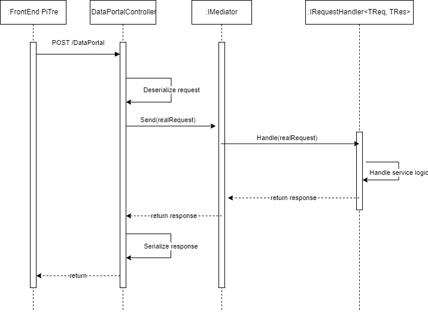

# Pi3.App.Legacy.WebApi

## Introduzione
Nell'ambito della nuova architettura del PiTre in cloud, **Pi3.App.Legacy.WebApi** è il microservizio dell'area Legacy utilizzato esclusivamente dal FrontEnd PiTre che implementa in REST tutti i servizi attualmente esposti dal servizio SOAP DocsPaWS.asmx.

Nella figura seguente, la Web Application è rappresentata dal POD denominato **web-api-legacy** all'interno del Cluster Kubernates : 


Dal FrontEnd PiTre tutte le invocazioni al servizio DocsPaWS.asmx sono dirottate, in maniera trasparente, alle nuove WebApi attraverso un meccanismo di routing basato sulle informazioni censite in una tabella denominata DPA_SWITCH_SERVICES presente all'interno di ciascun database PiTre. Per poter garantire l'attuale funzionamento del FrontEnd senza alcuna incompatibilità, le nuove WebApi mantengono lo stesso formato dati - sia in input che output - dei servizi esposti da DocsPaWS.asmx.

## Url Swagger

| Ambiente | Url Swagger |
| ---------| ------------|
| TEST | https://pitre-test.cloud-test-intra.tndigit.it/Legacy/swagger/index.html |
| QUALITY | https://pitre-qual.cloud-qual-intra.tndigit.it/Legacy/swagger/index.html |
| COLLAUDO | https://pitre-coll.cloud-qual-intra.tndigit.it/Legacy/swagger/index.html |
| FORMAZIONE | https://pitre-formazione.cloud-intra.tn.it/Legacy/swagger/index.html |
| PRODUZIONE | https://pitre.cloud-intra.tn.it/Legacy/swagger/index.html |


## Linguaggio, piattaforma e tool di sviluppo
C# 10, .NET 6, Visual Studio 2022.

## Struttura interna dell'applicazione

L'applicazione è suddivisa nei seguenti progetti:

| Nome progetto  | Descrizione |
| ------------- | ------------- |
| Pi3.App.Legacy.WebApi | Progetto che implementa l'applicazione Web con gli Api controller, i middleware, gli action filters, gli aspetti di registrazione delle librerie e dei package utilizzati. |
| Pi3.App.Legacy.WebApi.Application | Progetto che implementa la parte applicativa dell'applicazione Web, con la definizione degli handlers e i servizi. |
| Pi3.App.Legacy.WebApi.Tests | Progetto che implementa i test unitari. |
| DocsPaVO | Progetto in cui sono definiti tutti i Value Objects utilizzati da DocsPaWS.asmx come formato dati in input e output e necessari per l'applicazione Web allo scopo di mantenere la compatibilità con il FrontEnd. |
| Pi3.App.Legacy.WebApi.sln | File di solution. |

## Autenticazione
L'applicazione supporta l'autenticazione AAC, pertanto i client dovranno fornire nell'header di tutte le chiamate alle Api un access token valido.

## Progetto Pi3.App.Legacy.WebApi
Nel progetto sono implementate le Api controller, i middleware, gli action filters e gli aspetti di registrazione delle librerie e dei package utilizzati dall'applicazione.

### Supporto per tutte le istanze PiTre
L'applicazione serve tutte le istanze di PiTre con un meccanismo interno di routing che stabilisce la corretta stringa di connessione verso il database da utilizzare a partire un parametro denominato **{instance}** fornito dai client nell'url di ogni chiamata.

Per gli ambienti di TEST, QUALITY e PRODUZIONE, i valori supportati per il suddetto parametro sono elencati di seguito:
- APSS_INSTANCE
- COMPRENSORI_INSTANCE 
- COMUNETN_INSTANCE
- COMUNI_INSTANCE
- CONS_COMUNI_INSTANCE
- ENTI_INSTANCE
- LINCEI_INSTANCE
- PAT_INSTANCE
- REGIONE_INSTANCE
- SCUOLE_INSTANCE
- TNDIGIT_INSTANCE
- UNITN_INSTANCE

Per l'ambiente di FORMAZIONE, i valori supportati per il suddetto parametro sono elencati di seguito:
- ENTI_INSTANCE
- PAT1_INSTANCE
- PAT2_INSTANCE
- SCUOLE_INSTANCE
- TNDIGIT_INSTANCE

Per l'ambiente di COLLAUDO, i valori supportati per il suddetto parametro sono elencati di seguito:
- TNDIGIT_INSTANCE

Il namespace "Services\OracleDbContextFactory" definisce l'insieme delle classi factory necessarie per creare il DbContext con la stringa di connessione corretta verso l'istanza richiesta. In particolare, la classe "OracleDbContextFactoryService" ottiene il valore del parametro {instance} fornito dal FrontEnd PiTre nella route url, ottiene la corrispondente stringa di connessione dalle configurazioni ed istanzia l'oggetto OraclePi3DbContext (vedi listato seguente).

``` C#
public OraclePi3DbContext CreateDbContext()
{
    var instance = (this._httpContextAccessor.HttpContext.GetRouteValue("instance") ?? string.Empty).ToString().ToUpperInvariant();

    var connectionString = this._configuration.GetConnectionString(instance);

    this._logger.LogInformation($"Instance: {instance} - ConnectionString: {connectionString}");

    if (string.IsNullOrWhiteSpace(connectionString))
        throw new ConnectionStringNotFoundPi3Exception(instance);

    return new OraclePi3DbContext(
        this._serviceProvider.GetService<ILogger<OraclePi3DbContext>>(),
        Options.Create<OraclePi3DbContextOptions>(new OraclePi3DbContextOptions()
        {
            ConnectionString = connectionString
        }));
}
```
Tutte le stringhe di connessione sono definite nelle configurazioni dell'applicazione. Tenere presente che nel cluster Kubernetes le configurazioni sono fornite all'applicazione dinamicamente da variabili definite nel ConfigMap. I valori delle connection string sono presenti in Vault.

```
  "ConnectionStrings": {
    "PAT_INSTANCE": "*****",
    "APSS_INSTANCE": "*****",
    "COMPRENSORI_INSTANCE": "*****",
    "COMUNETN_INSTANCE": "*****"
    "COMUNI_INSTANCE": "*****",
    "CONS_COMUNI_INSTANCE": "*****",
    "ENTI_INSTANCE": "*****",
    "LINCEI_INSTANCE": "*****",
    "TNDIGIT_INSTANCE": "*****",
    "REGIONE_INSTANCE": "*****",",
    "SCUOLE_INSTANCE": "*****",
    "UNITN_INSTANCE": "*****"
  },

```

### Api controller

L'applicazione definisce le seguenti Api controller:
- SwitchServiceController
- DataPortalController

#### SwitchServiceController
Implementa un endpoint in GET per restituire l'elenco dei servizi di PiTre censiti all'interno della tabella DPA_SWITCH_SERVICES presente in ciascun database PiTre. Per ogni servizio è restituito il nome e l'informazione se esso risulta essere gestito come Web Api oppure come Web Service SOAP. In base a quest'informazione, il FrontEnd PiTre instrada la chiamata all'Api DataPortal oppure al vecchio servizio DocsPaWS.asmx.

L'endpoint per ottenere l'elenco dei servizi è il seguente:
```
/api/v1/{instance}/SwitchService
```

#### DataPortalController
Implementa un unico endpoint in POST per ricevere le richieste provenienti dal FrontEnd PiTre:

```
/api/v1/{instance}/DataPortal
```

Il formato JSON richiesto in input prevede un insieme di informazioni necessarie sia per identificare lato BackEnd il contesto dell'utente corrente che sta effettuando l'operazione sia il formato dati della request del servizio richiesto.

Di seguito si riporta il formato richiesto dall'endpoint ottenuto tramite Swagger (/Legacy/swagger/index.html):

```
{
  "principalContext": {
    "authenticationType": "string",
    "claims": [
      {
        "name": "string",
        "value": "string",
        "valueType": "string",
        "issuer": "string"
      }
    ]
  },
  "requestContext": {
    "type": "string",
    "asJson": "string"
  }
}
```

| Nome sezione  | Descrizione | Molteplicità |
| ------------- | ------------- | ------------- |
| principalContext | Contiene le informazioni, inviate dal FrontEnd, del contesto dell'utente corrente. Le informazioni di contesto sono opzionali, ovvero possono non essere inviate nel caso in cui il FrontEnd sta invocando un servizio prima ancora che l'utente si sia autenticato. | 0...1 |
| principalContext.authenticationType | Vi è indicato sempre il valore "pi3identityserver". | 0...1 |
| pricipalContext.claims | Contiene l'elenco dei claim accreditati all'utente corrente. Ciascun claim rappresenta un'attestazione dell'identità dell'utente chiamante, come ad esempio la UserId, il nome completo, il ruolo in ogranigramma PiTre cui si sta impersonificando da FrontEnd e le funzioni autorizzative associate al ruolo stesso, ecc.. In base alle informazioni fornite nell'elenco dei claims, la Web Application autorizza o meno la richiesta e crea l'oggetto System.Security.ClaimsPrincipal. | 0...1 |
| requestContext | Contiene le informazioni della richiesta del servizio richiamato dal FrontEnd. | 1...1 |
| requestContext.type | Contiene il nome del servizio richiesto. | 1...1 |
| requestContext.asJson | Contiene il payload della richiesta per richiamare il servizio richiesto. | 1...1 |

Nell'esempio seguente si riporta un payload completo inviato dal FrontEnd PiTre per invocare il servizio "DocumentoGetDettaglioDocumento":

```
{
    "principalContext": {
        "authenticationType": "pi3identityserver",
        "claims": [
            {
                "name": "https://pi3core/identity/claims/idUser",
                "value": ""********",
                "valueType": "string",
                "issuer": "pi3"
            },
            {
                "name": "https://pi3core/identity/claims/userId",
                "value": ""********",
                "valueType": "string",
                "issuer": "pi3"
            },
            {
                "name": "https://pi3core/identity/claims/userName",
                "value": ""********",
                "valueType": "string",
                "issuer": "pi3"
            },            
            {
                "name": "https://pi3core/identity/claims/userSurname",
                "value": ""********",
                "valueType": "string",
                "issuer": "pi3"
            },            
            {
                "name": "https://pi3core/identity/claims/idGroup",
                "value": ""********",
                "valueType": "string",
                "issuer": "pi3"
            },
            {
                "name": "https://pi3core/identity/claims/groupCode",
                "value": ""********",
                "valueType": "string",
                "issuer": "pi3"
            },   
            {
                "name": "https://pi3core/identity/claims/groupDescription",
                "value": ""********",
                "valueType": "string",
                "issuer": "pi3"
            },               
            {
                "name": "https://pi3core/identity/claims/idTenant",
                "value": ""********",
                "valueType": "string",
                "issuer": "pi3"
            },
            {
                "name": "https://pi3core/identity/claims/tenantCode",
                "value": ""********",
                "valueType": "string",
                "issuer": "pi3"
            },
            {
                "name": "https://pi3core/identity/claims/tenantDescription",
                "value": ""********",                
                "valueType": "string",
                "issuer": "pi3"
            },                                    
            {
                "name": "https://pi3core/identity/claims/authorization",
                "value": ""********",
                "valueType": "string",
                "issuer": "pi3"
            },
            {
                "name": "https://pi3core/identity/claims/authorization",
                "value": ""********",
                "valueType": "string",
                "issuer": "pi3"
            }
        ]
    },
    "requestContext": {
        "type": "DocumentoGetDettaglioDocumento",
        "asJson": "{\"infoutente\":{\"idCorrGlobali\":\"\",\"idPeople\":******,\"userId\":null,\"email\":null,\"dst\":\"\",\"idGruppo\":******,\"idAmministrazione\":\"******\",\"sede\":null,\"urlWA\":null,\"delegato\":null,\"extApplications\":null,\"codWorkingApplication\":null,\"matricola\":null,\"diSistema\":null},\"idProfile\":\"******\",\"docNumber\":\"******\"}"
    }
}
```

Nella tabella seguente sono riportati tutti i claims supportati dalla richiesta:

| Nome claim  | Descrizione | Molteplicità | Tipo dato |
| ------------- | ------------- | ------------- |  ------------- |
| https://pi3core/identity/claims/idUser | Identificativo univoco dell'utente corrente. | 1..1 | String |
| https://pi3core/identity/claims/userId | UserId univoca dell'utente corrente. | 1..1 | String |
| https://pi3core/identity/claims/userName | Nome dell'utente corrente. | 1..1 | String |
| https://pi3core/identity/claims/userSurname | Cognome dell'utente corrente. | 1..1 | String |
| https://pi3core/identity/claims/userEmail | Email dell'utente corrente. | 0..1 | String |
| https://pi3core/identity/claims/idGroup | Identificativo univoco del ruolo dell'utente corrente. | 1..1 | String |
| https://pi3core/identity/claims/groupCode | Codice univoco del ruolo dell'utente corrente.  | 1..1 | String |
| https://pi3core/identity/claims/groupDescription | Descrizione del ruolo dell'utente corrente.  | 1..1 | String |
| https://pi3core/identity/claims/idTenant | Identificativo univoco dell'amministrazione PiTre in cui è connesso l'utente.  | 1..1 | String |
| https://pi3core/identity/claims/tenantCode | Codice univoco dell'amministrazione PiTre in cui è connesso l'utente. | 1..1 | String |
| https://pi3core/identity/claims/tenantDescription | Descrizione univoca dell'amministrazione PiTre in cui è connesso l'utente. | 1..1 | String |
| https://pi3core/identity/claims/delegatedIdUser | Identificativo univoco dell'utente delegato che sta impersonificando. | 0..1 | String |
| https://pi3core/identity/claims/delegatedUserId | UserId univoca dell'utente delegato che sta impersonificando. | 0..1 | String |
| https://pi3core/identity/claims/delegatedUserName | Nome dell'utente delegato che sta impersonificando. | 0..1 | String |
| https://pi3core/identity/claims/delegatedUserSurname | Cognome dell'utente delegato che sta impersonificando. | 0..1 | String |
| https://pi3core/identity/claims/delegatedUserEmail | Email dell'utente delegato che sta impersonificando. | 0..1 | String |
| https://pi3core/identity/claims/admin | Indica se l'utente è un amministratore o meno. | 0..1 | Boolean |
| https://pi3core/identity/claims/superAdmin | Indica se l'utente è un superamministratore. Il claims è tipicamente attestato per utenti tecnici che effettuano operazioni di sistema o batch affinché possano impersonificarsi con qualunque ruolo in organigramma per accedere ai contenuti. In nessun caso potranno creare nuovi contenuti.  | 0..1 | Boolean |
| https://pi3core/identity/claims/authorization | Funzione autorizzativa abilitata sul ruolo corrente.  | 0..n | String |


In risposta, l'Api restituisce un JSON con le informazioni restituite dal servizio.

Di seguito si riporta il formato restituito dall'endpoint ottenuto tramite Swagger (/Legacy/swagger/index.html):

```
{
  "responseContext": {
    "type": "string",
    "asJson": "string",
    "jsonPropertyMappings": [
      {
        "name": "string",
        "type": "string"
      }
    ]
  }
}
```

| Nome sezione  | Descrizione | Molteplicità |
| ------------- | ------------- | ------------- |
| responseContext | Contiene le informazioni, restituite al FrontEnd, relative ai dati restituiti dal servizio richiesto. | 1...1 |
| responseContext.type | Indica il nome del servizio richiesto. | 1...1 |
| responseContext.asJson | Payload della risposta nel formato supportato dal FrontEnd. | 1...1 |
| responseContext.jsonPropertyMappings | Elenco di metadati che permette al FrontEnd di deserializzare nel modo corretto il payload presenti dell'attributo asJson.  | 1...n |

Nell'esempio seguente si riporta il payload completo restituito al FrontEnd PiTre per il servizio "amministrazioneGetAmministrazioniResult". I metadati presenti in jsonPropertyMappings indicano a FrontEnd PiTre che il json contiene un attributo denominato "output", da deserializzare nel tipo "DocsPaVO.utente.Amministrazione[]", e un attributo "returnMsg", da deserializzare nel tipo "System.String".

```
{
    "responseContext": {
        "type": "amministrazioneGetAmministrazioniResult",
        "asJson": "{\"output\":[{\"systemId\":\"****\",\"codice\":\"****\",\"descrizione\":\"****\",\"libreria\":null,\"email\":\"****\"},{\"systemId\":\"****\",\"codice\":\"****\",\"descrizione\":\"****\",\"libreria\":null,\"email\":null},{\"systemId\":\"****\",\"codice\":\"****\",\"descrizione\":\"****\",\"libreria\":null,\"email\":\"****\"},{\"systemId\":\"****\",\"codice\":\"****\",\"descrizione\":\"****\",\"libreria\":null,\"email\":\"****\"}],\"returnMsg\":null}",
        "jsonPropertyMappings": [
            {
                "name": "output",
                "type": "DocsPaVO.utente.Amministrazione[]"
            },
            {
                "name": "returnMsg",
                "type": "System.String"
            }
        ]
    }
}
```

#### Implementazione del modello CQRS

[CQRS](https://martinfowler.com/bliki/CQRS.html) (Command Query Responsability Segregation) supera il modello tradizionale standard suddividendo il modello concettuale in modelli ad oggetti distinti per l’aggiornamento Command) e la visualizzazione (Query).

Utilizzando la libreria [MediatR](https://github.com/jbogard/MediatR), la Web Application adotta il pattern CQRS per implementare tutti i servizi. MediatR è una libreria che implementa il pattern mediator, ha l'indubbio vantaggio di ridurre ulteriormente le dipendenze tra i moduli software e si è rivelata estremamente flessibile per l'implementazione di tutti i servizi. 

Per funzionare, MediatR richiede:
- la definizione di una classe (o record) contenente i dati della richiesta e che implementa l'interfaccia IRequest<TResponse>
- un'eventuale classe (o record) contenente i dati restituiti in risposta (TResponse)
- una classe handler che, ereditando dall'interfaccia IRequestHandler<TRequest,TResponse>, implementare la reale logica applicativa
- l'invocazione del metodo "Send" del mediator

Di seguito è riportato un esempio reale di utilizzo di MediatR:

``` C#
// Registrazione della libreria MediatR
builder.Services.AddMediatR(config => { // Codice omesso per brevità });

// Definizione oggetto in risposta al servizio AmmGetListAmministrazioni
public record AmmGetListAmministrazioniResult(InfoAmministrazione[] output);

// Definizione oggetto in richiesta al servizio AmmGetListAmministrazioni
public record AmmGetListAmministrazioni() : IRequest<AmmGetListAmministrazioniResult>;

// Implementazione classe handler
public class AmmGetListAmministrazioniHandler : IRequestHandler<AmmGetListAmministrazioniRequest, AmmGetListAmministrazioniResult>
{
        public async Task<AmmGetListAmministrazioniResult> Handle(AmmGetListAmministrazioniRequest request, CancellationToken cancellationToken)
        {
            // Codice omesso per brevità
        }
}

// Invocando il metodo "Send", MediatR individua l'handler registrato che corrisponde alla richiesta / risposta ed esegue il metodo Handle.
var mediator = _serviceProvider.GetRequiredService<IMediator>();
AmmGetListAmministrazioni request = new();
AmmGetListAmministrazioniResult response = await mediator.Send(request);
```

Il progetto "Pi3.App.Legacy.WebApi.Application" implementa il layer della logica applicativa della Web Application, in particolare  implementa tutti i servizi ciascuno in una classe handler MediatR dedicata.

Il DataPortalController converte la richiesta ricevuta in input dal FrontEnd PiTre nella corrispondente classe request MediatR ed invoca il metodo Send() richiamando l'handler corretto. Nel listato seguente, si riporta il codice del DataPortaController che costruisce la chiamata tramite Newtonsoft per deserializzare la richiesta e MediatR per inviarla:

``` C#
// Deserializzazione della richiesta ricevuta dal FrontEnd tramite Newtonsoft (la richiesta è stata serializzata sempre tramite Newtonsoft nella controparte di FrontEnd)
var realRequest = JsonConvert.DeserializeObject(
    request.RequestContext.AsJson,
    realRequestType,
    new Newtonsoft.Json.JsonSerializerSettings()
    {
        TypeNameHandling = Newtonsoft.Json.TypeNameHandling.All
    });

// Validazione dell'oggetto ricevuto, una volta deserializzato
Validator.ValidateObject(realRequest, new ValidationContext(realRequest), true);

// Invio della richiesta a MediatR, l'handler corrispondente viene richiamato
var realResponse = await this._mediator.Send(realRequest);

// Serializzazione della risposta tramite Newtonsoft (la risposta è deserializzata sempre tramite Newtonsoft dalla controparte di FrontEnd)
var response = new DataPortalResponse()
{
    ResponseContext = new ResponseContext()
    {
        Type = realResponse.GetType().Name,
        AsJson = JsonConvert.SerializeObject(realResponse,
            new Newtonsoft.Json.JsonSerializerSettings()
            {
                TypeNameHandling = Newtonsoft.Json.TypeNameHandling.Auto
            }),
        JsonPropertyMappings = realResponse?.GetType().GetProperties()
                    .Select(p => new ResponseJsonPropertyMapping()
                    {
                        Name = p.Name,
                        Type = p.PropertyType.FullName
                    })
                    .ToList()
                    .AsReadOnly()
    }
};
```
Nel diagramma di sequenza seguente è raffigurata l'interazione tra FrontEnd Pitre, DataPortalController, MediatR e Handler:



## Progetto Pi3.App.Legacy.WebApi.Application

Il progetto "Pi3.App.Legacy.WebApi.Application" implementa il layer della logica applicativa della Web Application.

Definisce i seguenti namespaces:
| Namespace | Descrizione |
| ------------- | ------------- |
| Behaviors | Contiene eventuali classi comportamentali da inserire nella pipeline di MediatR. |
| DomainEventHandlers | Contiene eventuali classi che intercettano gli eventi di dominio DDD. |
| Extensions | Eventuali classi di estensione utilizzate dal layer applicativo. |
| Handlers | Implementazione di tutte le classi handler MediatR per i servizi PiTre. Per un elenco completo degli handler MediatR implementati, cliccare [qui](/Docs/Handlers.md). |
| Models | Eventuali classi model comuni a tutti gli handler MediatR. |
| Requests | Definizione delle classi (record) per le request e response MediatR. |
| Services | Implementazione dei servizi applicativi trasversali non riconducibili ai concetti di dominio DDD. |


## Elenco dei package Pi3 inclusi
- [Pi3.Core](/Docs/Pi3.Core.md)
- [Pi3.Infrastructure.AAC](https://gitlab.tndigit.it/tndigit/pitre/pi3.infrastructure.aac/-/blob/main/README.md?ref_type=heads)
- [Pi3.Infrastructure.Adobe](https://gitlab.tndigit.it/tndigit/pitre/pi3.infrastructure.adobe/-/blob/main/README.md?ref_type=heads)
- [Pi3.Infrastructure.PdfSharp.Decorators](https://gitlab.tndigit.it/tndigit/pitre/pi3.infrastructure.pdfsharp/-/blob/main/README.md?ref_type=heads)
- [Pi3.Infrastructure.DocumentFormat.OpenXml](https://gitlab.tndigit.it/tndigit/pitre/pi3.infrastructure.documentformat.openxml/-/blob/main/README.md?ref_type=heads)
- [Pi3.Infrastructure.Chilkat](https://gitlab.tndigit.it/tndigit/pitre/pi3.infrastructure.chilkat/-/blob/main/README.md?ref_type=heads)
- [Pi3.Infrastructure.Graph](https://gitlab.tndigit.it/tndigit/pitre/pi3.infrastructure.graph/-/blob/main/README.md?ref_type=heads)
- [Pi3.Infrastructure.Legacy.EF.Entities](https://gitlab.tndigit.it/tndigit/pitre/pi3.infrastructure.legacy/-/blob/main/Docs/Pi3.Infrastructure.Legacy.EF.Entities.md?ref_type=heads)
- [Pi3.Infrastructure.Legacy.EF.Oracle](https://gitlab.tndigit.it/tndigit/pitre/pi3.infrastructure.legacy/-/blob/main/Docs/Pi3.Infrastructure.Legacy.EF.Oracle.md?ref_type=heads)
- [Pi3.Infrastructure.Legacy.DocumentFSRepository](https://gitlab.tndigit.it/tndigit/pitre/pi3.infrastructure.legacy/-/blob/main/Docs/Pi3.Infrastructure.Legacy.EF.DocumentFSRepository.md?ref_type=heads)
- [Pi3.Infrastructure.Legacy.EF.AggregazioneDocumentaleAggregate](https://gitlab.tndigit.it/tndigit/pitre/pi3.infrastructure.legacy/-/blob/main/Docs/Pi3.Infrastructure.Legacy.EF.AggregazioneDocumentaleAggregate.md?ref_type=heads)
- [Pi3.Infrastructure.Legacy.EF.DelegaAggregate](https://gitlab.tndigit.it/tndigit/pitre/pi3.infrastructure.legacy/-/blob/main/Docs/Pi3.Infrastructure.Legacy.EF.DelegaAggregate.md?ref_type=heads)
- [Pi3.Infrastructure.Legacy.EF.DocumentoAmministrativoAggregate](https://gitlab.tndigit.it/tndigit/pitre/pi3.infrastructure.legacy/-/blob/main/Docs/Pi3.Infrastructure.Legacy.EF.DocumentoAmministrativoAggregate.md?ref_type=heads)
- [Pi3.Infrastructure.Legacy.EF.KeywordAggregate](https://gitlab.tndigit.it/tndigit/pitre/pi3.infrastructure.legacy/-/blob/main/Docs/Pi3.Infrastructure.Legacy.EF.KeywordAggregate.md?ref_type=heads)
- [Pi3.Infrastructure.Legacy.EF.ListaDistribuzioneAggregate](https://gitlab.tndigit.it/tndigit/pitre/pi3.infrastructure.legacy/-/blob/main/Docs/Pi3.Infrastructure.Legacy.EF.ListaDistribuzioneAggregate.md?ref_type=heads)
- [Pi3.Infrastructure.Legacy.EF.MezzoSpedizioneAggregate](https://gitlab.tndigit.it/tndigit/pitre/pi3.infrastructure.legacy/-/blob/main/Docs/Pi3.Infrastructure.Legacy.EF.MezzoSpedizioneAggregate.md?ref_type=heads)
- [Pi3.Infrastructure.Legacy.EF.ModelloTrasmissioneAggregate](https://gitlab.tndigit.it/tndigit/pitre/pi3.infrastructure.legacy/-/blob/main/Docs/Pi3.Infrastructure.Legacy.EF.ModelloTrasmissioneAggregate.md?ref_type=heads)
- [Pi3.Infrastructure.Legacy.EF.NotaAggregate](https://gitlab.tndigit.it/tndigit/pitre/pi3.infrastructure.legacy/-/blob/main/Docs/Pi3.Infrastructure.Legacy.EF.NotaAggregate.md?ref_type=heads)
- [Pi3.Infrastructure.Legacy.EF.NotaRFAggregate](https://gitlab.tndigit.it/tndigit/pitre/pi3.infrastructure.legacy/-/blob/main/Docs/Pi3.Infrastructure.Legacy.EF.NotaRFAggregate.md?ref_type=heads)
- [Pi3.Infrastructure.Legacy.EF.OggettoAggregate](https://gitlab.tndigit.it/tndigit/pitre/pi3.infrastructure.legacy/-/blob/main/Docs/Pi3.Infrastructure.Legacy.EF.OggettoAggregate.md?ref_type=heads)
- [Pi3.Infrastructure.Legacy.EF.PersonaCorrispondenteAggregate](https://gitlab.tndigit.it/tndigit/pitre/pi3.infrastructure.legacy/-/blob/main/Docs/Pi3.Infrastructure.Legacy.EF.PersonaCorrispondenteAggregate.md?ref_type=heads)
- [Pi3.Infrastructure.Legacy.EF.RagioneTrasmissioneAggregate](https://gitlab.tndigit.it/tndigit/pitre/pi3.infrastructure.legacy/-/blob/main/Docs/Pi3.Infrastructure.Legacy.EF.RagioneTrasmissioneAggregate.md?ref_type=heads)
- [Pi3.Infrastructure.Legacy.EF.RuoloCorrispondenteAggregate](https://gitlab.tndigit.it/tndigit/pitre/pi3.infrastructure.legacy/-/blob/main/Docs/Pi3.Infrastructure.Legacy.EF.RuoloCorrispondenteAggregate.md?ref_type=heads)
- [Pi3.Infrastructure.Legacy.EF.Services](https://gitlab.tndigit.it/tndigit/pitre/pi3.infrastructure.legacy/-/blob/main/Docs/Pi3.Infrastructure.Legacy.EF.Services.md?ref_type=heads)
- [Pi3.Infrastructure.Legacy.EF.TrasmissioneAggregate](https://gitlab.tndigit.it/tndigit/pitre/pi3.infrastructure.legacy/-/blob/main/Docs/Pi3.Infrastructure.Legacy.EF.TrasmissioneAggregate.md?ref_type=heads)
- [Pi3.Infrastructure.Legacy.EF.UOCorrispondenteAggregate](https://gitlab.tndigit.it/tndigit/pitre/pi3.infrastructure.legacy/-/blob/main/Docs/Pi3.Infrastructure.Legacy.EF.UOCorrispondenteAggregate.md?ref_type=heads)
