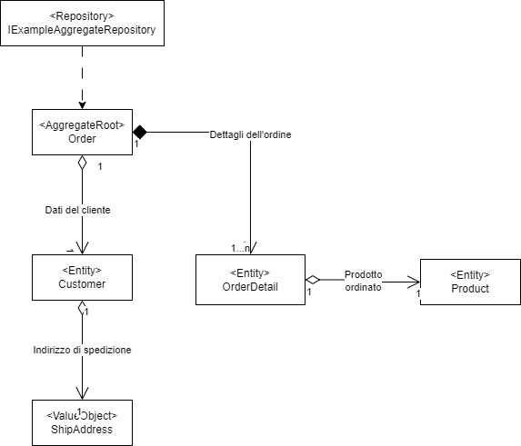

# Package Pi3.Core
E' il package contenente tutte le astrazioni utilizzate dagli altri package i quali derivano tutti da Pi3.Core.

## Installa il package

Installa il package tramite NuGet Package Manager:

```
Install-Package Pi3.Core
```

Oppure tramite l'interfaccia della riga di comando di .NET Core:

```
dotnet add package Pi3.Core
```

## Registra il package Pi3.Core con IServiceCollection
Il package Pi3.Core supporta direttamente 
Microsoft.Extensions.DependencyInjection.Abstractions, pertanto è sufficiente utilizzare la sintassi seguente per registrare tutti i tipi e i servizi supportati.

```C#
services.AddPi3Core();
```
Questo registra:
- `IEventPublisher` come scoped
- `IFileConverterFactory` come scoped
- `IFileTextExtractorFactory` come scoped

## Il namespace SeedWork

In SeedWork, sono definite classi astratte ed interfacce utilizzate come base comune per tutti gli oggetti di dominio, evitando così la scrittura di codice ridondante.

| Descrizione | Interfacce e classi base astratte |
| ------------- | ------------- |
Interfacce e classi basi astratte che concorrono alla definizione di un aggregate secondo il paradigma DDD. | IAggregateRoot, AggregateRoot, IEntity, Entity, IValueObject, ValueObject, IEvent, Event, IEventPublisher, IEventHandler, IRepository, Repository, ILoadBehavior | 
 Classi base astratte per la gestione delle eccezioni. | Pi3Exception, UnauthorizedPi3Exception, NotSupportedPi3Exception, NotFoundPi3Exception, MethodNotImplementedPi3Exception, InvalidAggregatePi3Exception, BadRequestPi3Exception  |
| Classi per la gestione del testo unificata del testo e del testo multilingua. | TextValue, MultiLanguageTextValue |

### Come creare un nuovo aggregato
Per creare un nuovo aggregato è neccessario implementare nuove classi estendendo quelle definite in SeedWork. 

Nello scenario seguente è realizzato un Aggregate denominato OrderAggregate, in cui è simulato un semplice (e non esaustivo) dominio per la gestione di un ordine, dei suoi dettagli e del cliente che l'ha effettuato. Nei paragrafi successivi sono riportati alcuni estratti di codice; si rimanda al progetto "Pi3.Core.Test" per l'implementazione completa ed il relativo test unitario.

#### OrderAggregate ClassDiagram


#### Concetti
Alcuni concetti da tenere presente quando si realizza un Aggregate:
- Le entity sono i concetti del dominio che hanno un'identità e devono estendere la classe base Entity.
- L'entity principale del dominio è denominata AggregateRoot e deve estendere la class base AggregateRoot. 
- Lo stato degli oggetti dell'aggregate (AggregateRoot ed Entity) può essere modificato solo attraverso le operazioni pubbliche definite dall'AggregateRoot.
- Dall'esterno non deve essere possibile accedere ad operazioni di modifica dello stato di un'Entity non root né istanziare un'Entity non root.
- Le modifiche allo stato interno dell'aggregate devono essere effettuate utilizzando le classi Event. In pratica, ogni modifica allo stato deve essere gestito attraverso i meccanismi nativi dell'AggregateRoot che prevedono di definire una specifica classe Event per ogni evento (es. "IndirizzoModificato") e la relativa gestione in un metodo interno denominato "Handle".
- I ValueObject sono gli oggetti del dominio che non hanno un'identità e sono concepiti come classi il cui stato è immutabile. Tipicamente non hanno logica applicativa se non per validare i propri attributi, possono contenere ulteriori ValueObject ma non Entity. Possono essere istanziate anche dall'esterno dell'aggregate.
- La persistenza dell'aggregate è gestita mediante il proprio repository.

#### Creazione dell'AggregateRoot Order

Order, ereditando da AggregateRoot, rappresenta l'entità radice dell'aggregato. Nella dichiarazione della classe è definita la tipologia della chiave Id (in questo caso, String).

Lo stato dell'aggregate, ovvero gli attributi così come lo stato delle altre entities e dei value objects del dominio, possono essere modificati dall'esterno solo attraverso i metodi pubblici esposti dall'AggregateRoot.

L'AggregateRoot deve implementare la logica di validazione. Il metodo GetErrors() restituisce la lista delle eccezioni del dominio verificando la correttezza complessiva dello stato dell'intero aggregate. Nei metodi pubblici che modificano lo stato, inoltre, può essere implementata contestualmente la validazione sui singoli parametri forniti in input.

Il cambio di stato dell'aggregate avviene richiamando il metodo interno ApplyChange() il quale accetta in input un oggetto Event contenente le informazioni dello specifico evento di modifica. Il metodo ApplyChange() deve essere invocato direttamente nel metodo pubblico richiamato dall'esterno. L'effettivo cambio di stato avvenire nel corrispondente metodo interno Handle(), il quale riceve in input l'istanza dell'evento e appplica le modifiche agli attributi, entities o value objects dell'aggregato. Il metodo GetUncommittedChanges() dell'AggregateRoot restituisce l'elenco degli eventi verificatisi.

```C#
    public class Order : AggregateRoot<string>
    {
        #region Public Members

        public Order(string id)
        {
            this.ApplyChange(new OrderCreated() { Id = id });
        }

        public override IEnumerable<Pi3Exception> GetErrors()
        {
            var errors = new List<Pi3Exception>();

            if (this.Customer == null)
                errors.Add(new MissingCustomerPi3Exception());

            if (!this._orderDetails.Any())
                errors.Add(new MissingOrderDetailsPi3Exception());

            return errors;
        }

        public void AddCustomer(string idCustomer, string customerName, ShipAddress shipAddress)
        {
            idCustomer = idCustomer ?? throw new ArgumentNullException(nameof(idCustomer));
            customerName = customerName ?? throw new ArgumentNullException(nameof(customerName));
            shipAddress = shipAddress ?? throw new ArgumentNullException(nameof(shipAddress));

            Validator.ValidateObject(shipAddress, new ValidationContext(shipAddress), true);

            this.ApplyChange(new CustomerAdded()
            {
                IdCustomer = idCustomer,
                CustomerName = customerName,
                ShipAddress = shipAddress
            });
        }

        public void ChangeCustomerShipAddress(ShipAddress newShipAddress)
        {
            newShipAddress = newShipAddress ?? throw new ArgumentNullException(nameof(newShipAddress));

            Validator.ValidateObject(newShipAddress, new ValidationContext(newShipAddress), true);

            this.ApplyChange(new CustomerShipAddressChanged()
            {
                NewShipAddress = newShipAddress
            });
        }

        public Customer Customer { get; protected set; } = null!;

        public void AddOrderDetail(int idProduct, TextValue productName, double unitPrice, int quantity = 1, int? discount = null)
        {
            productName = productName ?? throw new ArgumentNullException(nameof(productName));

            this.ApplyChange(new OrderDetailAdded()
            {
                IdOrderDetail = Guid.NewGuid(),
                IdProduct = idProduct,
                ProductName = productName,
                UnitPrice = unitPrice,
                Quantity = quantity,
                Discount = discount
            });
        }

        public void ChangeOrderDetailQuantity(Guid idOrderDetail, int newQuantity)
        {
            this.ApplyChange(new OrderDetailQuantityChanged()
            {
                IdOrderDetail = Guid.NewGuid(),
                NewQuantity = newQuantity
            });
        }

        public void ChangeOrderDetailDiscount(Guid idOrderDetail, int newDiscount)
        {
            this.ApplyChange(new OrderDetailDiscountChanged()
            {
                IdOrderDetail = Guid.NewGuid(),
                NewDiscount = newDiscount
            });
        }

        public IReadOnlyCollection<OrderDetail>? OrderDetails
        {
            get
            {
                return this._orderDetails?.AsReadOnly();
            }
        }

        public double? OrderAmount
        {
            get
            {
                return this._orderDetails?.Sum(od => od.Amount);
            }
        }

        #endregion

        #region Private Members

        protected List<OrderDetail> _orderDetails = null!;

        protected void Handle(OrderCreated @event)
        {
            this.Id = @event.Id;
            this._orderDetails = new List<OrderDetail>();
        }

        protected void Handle(CustomerAdded @event)
        {
            this.Customer = new Customer(@event.IdCustomer, @event.CustomerName, @event.ShipAddress);
        }

        protected void Handle(CustomerShipAddressChanged @event)
        {
            this.Customer?.ChangeShipAddress(@event.NewShipAddress);
        }

        protected void Handle(OrderDetailAdded @event)
        {
            this._orderDetails.Add(new OrderDetail(@event.IdOrderDetail, @event.IdProduct, @event.ProductName, @event.UnitPrice, @event.Quantity, @event.Discount));
        }

        protected void Handle(OrderDetailQuantityChanged @event)
        {
            var entity = this._orderDetails?.Find(od => od.Id == @event.IdOrderDetail);

            entity?.ChangeQuantity(@event.NewQuantity);
        }

        protected void Handle(OrderDetailDiscountChanged @event)
        {
            var entity = this._orderDetails?.Find(od => od.Id == @event.IdOrderDetail);

            entity?.ChangeDiscount(@event.NewDiscount);
        }

        #endregion
    }    
```

#### Creazione del Repository IOrderRepository

Il Repository definisce l'oggetto deputato alla persistenza dei dati dell'intero aggregate. Nei package Core è definita solamente l'interfaccia del Repository, la persistenza dovrà essere implementata nel layer Infrastructure o Application. 

```C#
    public interface IOrderRepository : IRepository<Order, string>
    {
    }
```

#### Creazione dell'Entity Customer

Le Entity del dominio possono essere istanziate e modificate nello stato solo dall'AggregateRoot, per questo motivo sia il construttore che i metodi per la modifica dello stato sono dichiarati internal. Nell'esempio specifico è realizzata l'entità di dominio Customer, che rappresentano le informazioni (minimali ed inerenti al domino Order) del cliente che ha effettuato l'ordine.

```C#
    public class Customer : Entity<string>
    {
        #region Public Members

        internal Customer(string id, string name, ShipAddress shipAddress)
        {
            id = id ?? throw new ArgumentNullException(nameof(id));
            name = name ?? throw new ArgumentNullException(nameof(name));
            shipAddress = shipAddress ?? throw new ArgumentNullException(nameof(shipAddress));

            Validator.ValidateObject(shipAddress, new ValidationContext(shipAddress), true);

            this.Id = id;
            this.Name = name;
            this.ShipAddress = shipAddress;
        }

        public string Name { get; protected set; }

        internal void ChangeShipAddress(ShipAddress newShipAddress)
        {
            newShipAddress = newShipAddress ?? throw new ArgumentNullException(nameof(newShipAddress));
            Validator.ValidateObject(newShipAddress, new ValidationContext(newShipAddress), true);

            this.ShipAddress = newShipAddress;
        }

        public ShipAddress ShipAddress { get; protected set; }

        #endregion

        #region Private Members

        #endregion
    }
```

#### Creazione della classe ValueObject ShipAddress

I ValueObject, essendo oggetti di dominio immodificabili e senza identità, possono essere creati esternamente all'aggregate. Nell'esempio specifico, è riportata la classe ShipAddress che rappresenta le informazioni relative all'indirizzo di spedizione dell'ordine. Tutte le proprietà sono dichiarate come init only.

```C#
    public class ShipAddress : ValueObject
    {
        [Required(AllowEmptyStrings = false)]
        public string Address { get; init; } = null!;

        [Required(AllowEmptyStrings = false)]
        public string City { get; init; } = null!;

        [Required(AllowEmptyStrings = false)]
        public string Country { get; init; } = null!;
    }
```

#### Creazione delle classi per la gestione degli eventi

Gli eventi sono le classi che rappresentano il cambio di stato dell'aggregate. Dovrà essere definita una singola classe evento, col nome orientato al passato, per ogni cambio di stato avvenuto nell'aggregate. 
Nell'esempio specifico, è riportato l'evento di aggiunta delle informazioni relative al cliente che ha effettuato l'ordine.

```C#
    public class CustomerAdded : Event
    {
        public string IdCustomer { get; init; } = null!;
        public string CustomerName { get; init; } = null!;
        public ShipAddress ShipAddress { get; init; } = null!;
    }
```

#### Creazione delle eccezioni del dominio

Lo stato non valido all'interno dell'aggregato è rappresentato con le eccezioni del dominio. Implementare una classe Pi3Exception per ogni regola di validazione violata. Tipicamente, le descrizioni degli errori sono inseriti all'interno di un file di risorse interno all'aggregate.
Nell'esempio specifico, sono riportate le eccezioni relative alle regole non rispettate del dominio Order  (es. sconto non ammesso, cliente mancante).

```C#
    public class InvalidDiscountPi3Exception : Pi3Exception
    {
        #region Public Members

        public InvalidDiscountPi3Exception()
            : base(ErrorDescriptions.InvalidDiscount, null, ErrorDescriptions.ResourceManager)
        {
        }

        #endregion
    }
    
    public class MissingCustomerPi3Exception : Pi3Exception
    {
        #region Public Members

        public MissingCustomerPi3Exception()
            : base(ErrorDescriptions.MissingCustomer, null, ErrorDescriptions.ResourceManager)
        {
        }

        #endregion
    }
```

#### Implementazione di un repository

Il repository definisce la persistenza dei dati dell'intero aggregate. Benché l'implementazione di un repository deve essere effettuata all'interno dei package infrastrutturali poiché in essi è realizzata effettivamente la tecnologia per la persistenza (es. DBMS, NoSql, file system, ecc.), nel listato seguente  è riportato un esempio di persistenza dell'aggregato Order in memoria.

```C#
    public class InMemoryOrderRepository : IOrderRepository
    {
        #region Public Members

        public async Task<bool> Exists(string idAggregate)
        {
            return await Task.Run(() =>
            {
                return this._orders.Any(a => a.Id.Equals(idAggregate));
            });
        }

        public async Task<Order> Get(string idAggregate, params ILoadBehavior[] loadBehaviors)
        {
            return await Task.Run(() =>
            {
                return this._orders.FirstOrDefault(a => a.Id.Equals(idAggregate));
            });
        }

        public async Task Add(Order aggregate)
        {
            await Task.Run(() =>
            {
                if (!aggregate.IsValid())
                    throw new InvalidAggregatePi3Exception(aggregate.GetErrors());

                this._orders.Add(aggregate);
                aggregate.MarkChangesAsCommitted();
            });
        }

        public async Task Update(Order aggregate)
        {
            await Task.Run(() =>
            {
                if (!aggregate.IsValid())
                    throw new InvalidAggregatePi3Exception(aggregate.GetErrors());

                this._orders.Remove(aggregate);
                this._orders.Add(aggregate);
                aggregate.MarkChangesAsCommitted();
            });
        }

        public async Task Delete(Order aggregate)
        {
            await Task.Run(() =>
            {
                this._orders.Remove(aggregate);
                aggregate.MarkChangesAsCommitted();
            });
        }

        public async Task Load(Order aggregate, params ILoadBehavior[] loadBehaviors)
        {
            throw new NotImplementedException();
        }

        #endregion

        #region Private Members

        protected readonly List<Order> _orders = new List<Order>();

        #endregion
    }
```
#### Struttura namespace dell'aggregate

La tipica struttura di un aggregate, in termini di namespace, è la seguente:

| Cartella | Descrizione |
| ------------- | ------------- |
| Entities | Namespace in cui sono presenti le entità di dominio. |
| Events | Namespace in cui sono presenti gli eventi di dominio. |
| Exceptions | Namespace in cui sono presenti le eccezioni di dominio. |
| Repositories | Namespace in cui sono definite le interfaccie repository per la persistenza. |
| Resources | Namespace in cui sono creati i file di risorse. |
| ValueObjects | Namespace in cui sono presenti gli oggetti di valore del dominio. |

## Il namespace Extensions
In Extensions sono definite alcune classi di estensione comunemente utilizzate nel sistema. 

| Extension class | Descrizione |
| ------------- | ------------- |
| ByteArrayExtensions | Estende l'impronta SHA256 e SHA512 da un byte array. |
| DataSetExtensions | A partire da una lista di oggetti, genera dinamicamente un oggetto DataSet mappando i nomi delle colonne con le rispettive proprietà dei singoli oggetti mappati.  |
| DateTimeExtensions | Offre funzioni di formattazione stringa di date secondo i formati stringa più comunemente usati in PiTre. |
| DistributedCacheExtensions | Offre funzioni per l'utilizzo della cache, in particolare ne semplifica la gestione evitando al client di scrivere codice per la verifica dell'esistenza di un oggetto in cache.  |
| ErrorExtensions | Sia per ottenere una gestione multilingua che per evitare di scrivere testo nel codice, le descrizioni degli errori sono sempre inserite all'interno dei file di risorse. Nel file di risorse, ogni descrizione dell'errore è associata ad un codice univoco. La classe offre funzioni per ottenere il codice dell'errore a partire dalla sua descrizione. |
| StringExtensions | Offre diverse funzioni di estensione per le stringhe. |
| XmlSerializationExtensions | Offre funzioni per la serializzazione / deserializzazione di un oggetto in formato Xml. |

## Il namespace Services
In Services sono definite le interfacce di servizi trasversali non riconducibili a concetti di dominio. Nella tabella seguente sono riepilogate le tipologie di servizi presenti, la cui implementazione deve essere effettuata concretamente all'interno dei package infrastructure:

| Tipologia servizio | Descrizione |
| ------------- | ------------- |
| Configuration | L'interfaccia IConfigurationService consente di ottenere i valori di configurazione presenti in PiTre. |
| Email\Sender | L'interfaccia IEmailSenderService consente di inviare email (PEC, PEO) con o senza allegati. |
| File\Converters | L'interfaccia IFileConverterService permette di convertire un file in un determinato formato di output. Poiché nel sistema possono essere registrate più tipologie di convertitori, l'interfaccia IFileConverterFactory ne facilita la gestione consentendo all'utilizzatore di utilizzare un unico punto di accesso. |
| File\Decorators | L'interfaccia IFileDecoratorService permette di applicare ad un file uno o più layer di contenuti (testuali o immagine). |
| File\ReportGenerator | L'interfaccia IReportGeneratorService offre un servizio per la creazione di report in formato tabellare, ottenendo come formati di output file excel, open office, pdf. |
| File\Spreadsheet | L'interfaccai ISpreadsheetService offre un servizio per la lettura e scrittura dati su un foglio di calcolo. |
| File\TextExtractors | L'interfaccia IFileTextExtractorService permette di estrarre il testo presente all'interno di un file. Poiché nel sistema possono essere registrate più tipologie di estrattori, l'interfaccia IFileTextExtractorFactory ne facilita la gestione consentendo all'utilizzatore di utilizzare un unico punto di accesso. |
| Principal | L'interfaccia IClaimsPrincipalService permette di ottenere l'oggetto Principal attivo. |
| Security | L'interfaccia IAuthenticationService consente di generare un token di autenticazione OAuth2. |
| WebMethodLogger | L'interfaccia IWebMethodLoggerService permette di scrivere i log dei servizi web di PiTre. |


