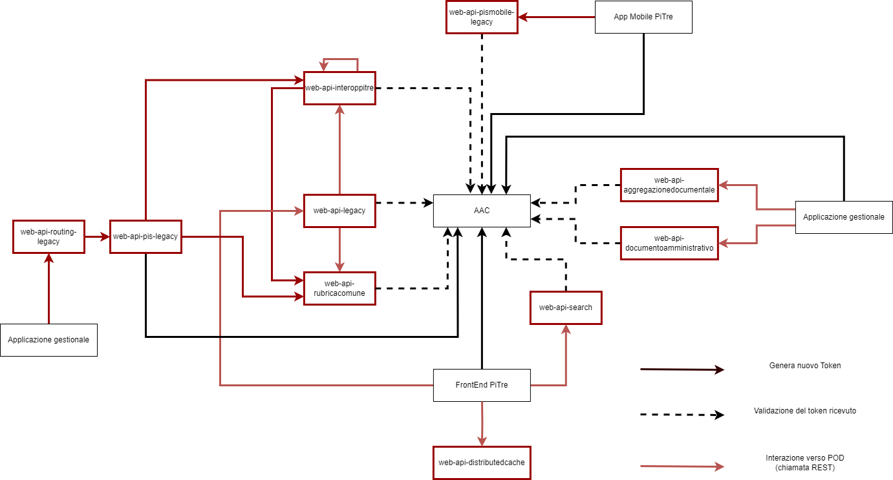

# Pi3.Infrastructure.AAC

Il package permette di integrare i dettagli infrastrutturali per utilizzare l'autenticazione OAUTH2 tramite l'infrastruttura AAC.

## Installa il package

Installa il package tramite NuGet Package Manager:

```
Install-Package Pi3.Infrastructure.AAC
```

Oppure tramite l'interfaccia della riga di comando di .NET Core:

```
dotnet add package Pi3.Infrastructure.AAC
```

## Registra il package Pi3.Infrastructure.AAC con IServiceCollection
Il package Pi3.Infrastructure.AAC supporta direttamente 
Microsoft.Extensions.DependencyInjection.Abstractions, pertanto è sufficiente utilizzare la sintassi seguente per registrare tutti i tipi e i servizi supportati.

```C#
// Registra l'infrastruttura AAC.
services.AddInfrastructureAAC("urlJWK");
```
Questo registra i servizi richiesti per l'autenticazione JWT-bearer.

Valori richiesti per urlJWK per ambiente:
- Test: https://aac-test.cloud-test.tndigit.it/jwk
- Quality: https://aac.cloud-qual.tndigit.it/oauth/token
- Produzione: https://autenticazione.cloud.provincia.tn.it/oauth/token

## Package Pi3 inclusi

Nessuno

## Interazioni con AAC
L'autenticazione in OAUTH2 con il sistema AAC è utilizzata per autenticare le richieste alle WebApi realizzate tramite l'infrastruttura Pi3 Core.

Nello schema seguente sono riportate le interazioni con AAC all'interno del sistema. 
I rettangoli rossi riportano i POD relativi alle WebApi che, integrando il package Pi3.Infrastructure.AAC, validano il bearer token ricevuto dal client (frecce tratteggiate). Le WebApi non generano token, eccetto _web-api-pis-legacy_ che non ricevendo token in input (l'autenticazione dai client è fatta tramite certificato) devono generare un nuovo token per autenticarsi con _web-api-rubricacomune-legacy_. La generazione di un nuovo token è rappresentata da una freccia continua.




